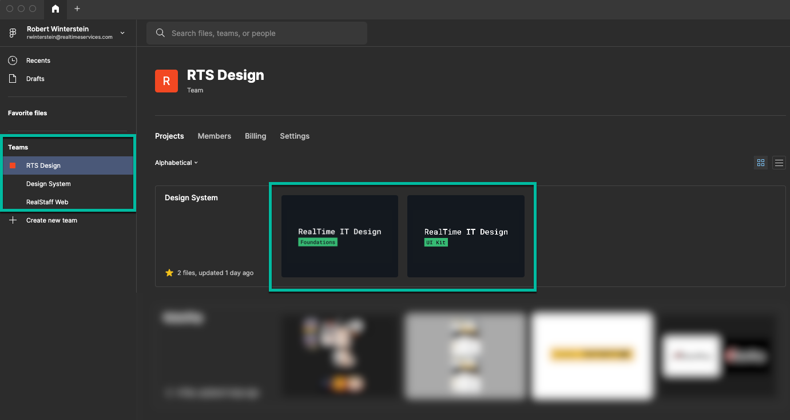
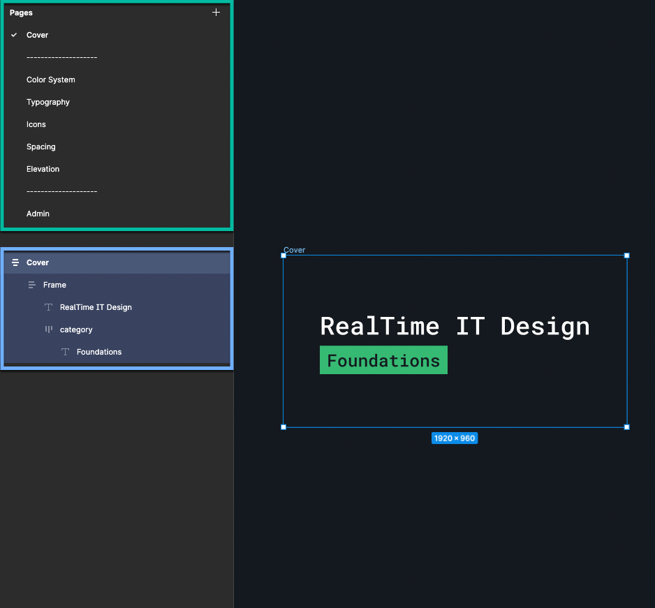

# RTS Design System Guide

The purpose of the design system is to create a library of standardized styles and assets for RealStaff Web, the Employee Portal, and other products and assets within RealTime. This guide will explain a brief overview of where to find the design files and how to view the styles and assets.

## Teams, Projects, & Files

The RTS Design team will be listed on the left panel when Figma is opened. From here, you can view the teams **projects** and **files**.

For this guide, the **project** is “Design System” which currently contains two **files**, “Foundations Kit” and “UI Kit”.

The different assets and styles within these files are what make up the building blocks for the design system. The Foundations Kit contains assets such as color styles, typography styles, the Material Design icon set, and spacing and elevation guidelines. Because these are the foundational elements to a design system, the UI Kit utilizes the Foundations Kit. The UI Kit contains the components such as buttons, drop-downs, input fields, and more which are then used to build sections and pages.

The image below shows where to find the RTS Design team [left] and projects and files [right]. You can also click the **star** where the project is listed to pin that project to the left panel for quicker navigation.

---

## Pages & Layers

Once inside of a file, the left panel will now display pages which will each contain their own assets.

Below pages you will find the different layers on the selected page. These layers will highlight when hovered or selected so you know exactly what layer you’re viewing.

