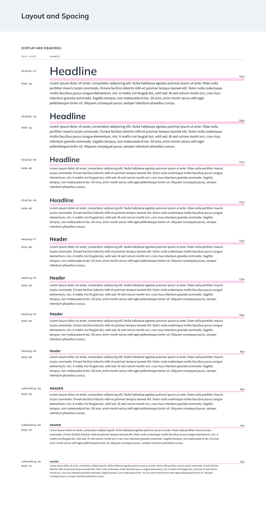

# RTS Design System Guide

The purpose of the design system is to create a library of standardized styles and assets for RealStaff Web, the Employee Portal, and other products and assets within RealTime. This guide will explain a brief overview of where to find the design files and how to view the styles and assets.

## Teams, Projects, & Files

The RTS Design team will be listed on the left panel when Figma is opened. From here, you can view the teams **projects** and **files**.

For this guide, the **project** is “Design System” which currently contains two **files**, “Foundations Kit” and “UI Kit”.

The different assets and styles within these files are what make up the building blocks for the design system. The Foundations Kit contains assets such as color styles, typography styles, the Material Design icon set, and spacing and elevation guidelines. Because these are the foundational elements to a design system, the UI Kit utilizes the Foundations Kit. The UI Kit contains the components such as buttons, drop-downs, input fields, and more which are then used to build sections and pages.

The image below shows where to find the RTS Design team [left] and projects and files [right]. You can also click the **star** where the project is listed to pin that project to the left panel for quicker navigation.

---

## Pages & Layers

Once inside of a file, the left panel will now display **pages** which will each contain their own assets.

Below pages you will find the different **layers** on the selected page. These layers will highlight when hovered or selected so you know exactly what layer you’re viewing.

---

## Layer Selection

By hovering on a layer, whether it be the actual element on the page, or in the list of layers, you will see an outline for the respective layer on the page and layer name on the left panel.

---

## Deep Select

You can select nested elements within groups or frames by double-clicking on the element you wish to select. However, this can be tedious as designs become complex where it is not uncommon to have 4 or more levels of nested elements, and double-clicking once only bring you down 1 level at a time.

An alternative is to hold **Command** (macOS) or **Control** (Windows) key while hovering on the desired element to **deep select** that element which will automatically bring you as many levels down to that nested element. When hovering + and holding cmd/ctrl, you’ll notice the outline will transition from the group to the nested layer like below.

---

## Layer Inspect

When a layer is selected, the **inspect** panel will display various information and properties for that layer including CSS styles for fonts, colors, box-sizing, and more which can be copied and pasted.

In addition, if a layer is selected and the inspect panel is open, you can hover over a different layer to display the spacing between the two layers.

Note that not all of these properties should be used for development. This guide will have a separate section for specs necessary for handoff, specifically for components, which have been tested with the preset styles that Material components come with.

---

## Foundations Kit - Color Palette

Below is an example of the color palette. To achieve these colors, we start at the [color]-5 level and adjust for 4 levels down and 5 levels up in lightness to get the different shades for each color group. One color may be adjusted slightly different than another as the primary goal is to achieve a similar contrast to the eye along each color level. The color level (i.e. gray-5) is on top of the color swatch in either black or white text based on whichever satisfies or comes closest to [AA color contrast](https://wcag.com/designers/1-4-3-color-contrast/).

---

## Foundations Kit - Color Tokens

After establishing our color palette, those colors get assigned to **color tokens** which are semantically named and where the name is based on the context of the element. This approach allows for a much easier switch from light to dark mode and when applying company-based color palettes to the UI.

In the example to the right, a portion of the color tokens is displayed to show that they are grouped by color theme, followed by category, and then named based on context.

Context is used in place of naming conventions such as “text-dark” or “background-light”, because when changing from a light theme to a dark theme, those names will no longer make sense. By using contextual names, we instead only have to switch the color that is assigned to the token name.

For example, the standard text color is name “text-primary”. While in a light theme, the color assigned to this token will be black. When switching to a dark theme, we keep the same token name and switch the assigned color to white.

As the UI increases in complexity, we utilize several levels of context for the tokens, this way when switching themes, the elements retain a similar contrast against both light and dark background.

---

## Foundations Kit - Typography & Layout

Typography guidelines will display the different levels (text style), their use case, font family, size, line height, weight, and the suggested default color token. Typography is grouped into categories including Display and Headings, Body Content, and UI and Supporting Elements.

In addition, there are spacing guidelines provided for headings followed by body content and a suggested size paring based on which heading level is being used.

---

## UI Kit - Components

On the left panel under **Pages**, a list of components are able to be viewed. With in each component page, each variation of that component will be displayed as examples of what can be used within design layouts. In the example below for the badge component, there is a section for size, emphasis, and style. Depending on the component, there may be more or less categories for variations.

